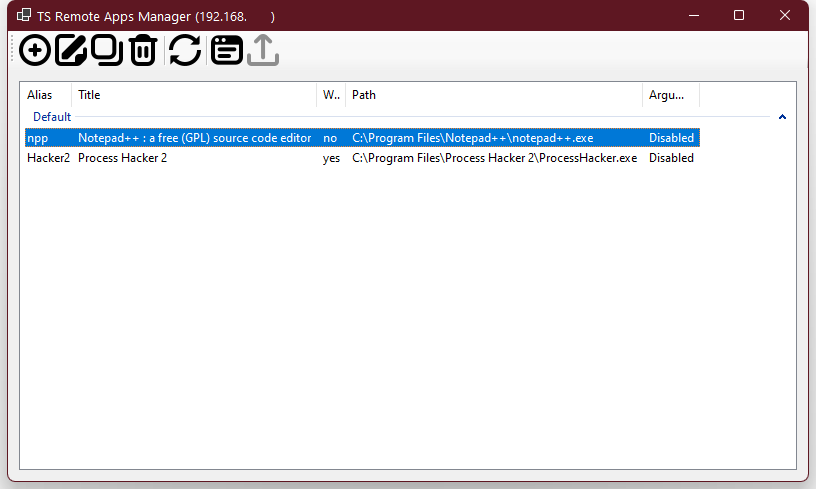
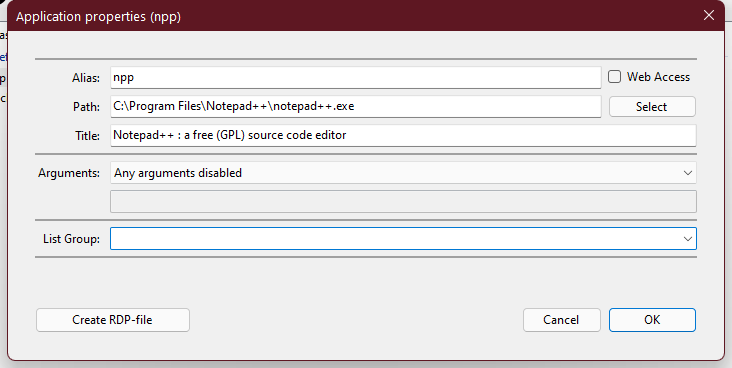
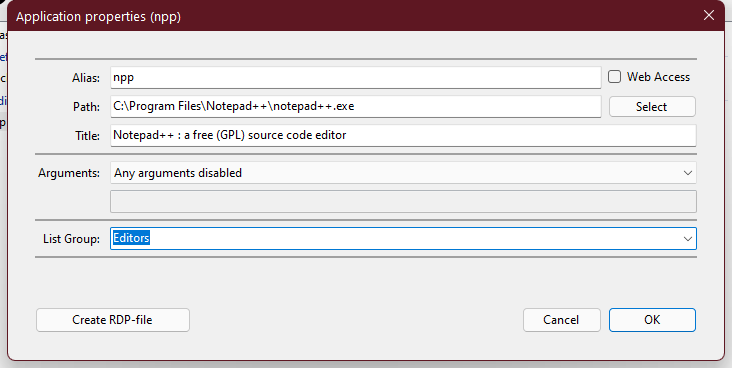
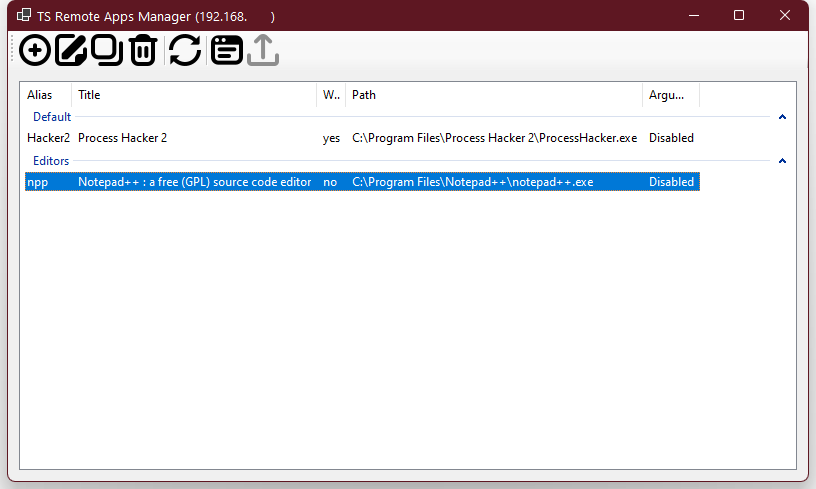
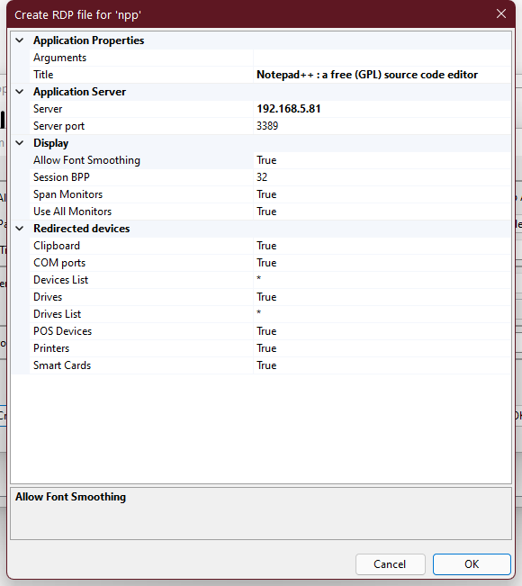

# TSRemoteAppMgr
A small tool for SOHO admins to manage Terminal server Remote Applications

## Local or remote server connection
You can connect to local or remote Terminal Server using startup dialog.

## Main application screen
After Login dialog, you will see Main application screen.

Top toolbar buttons allow you to add, edit or remove applications on selected server.
Also you can use keyboard keys like Ins, Del, Enter.

## Edit selected application properties
You can edit selected application properties:

And if you specify a group name in the watch field, it will allow you to group the applications in the main window into groups:

## Create RDP-file
From the application editing form, you can get an RDP-file to run it.

